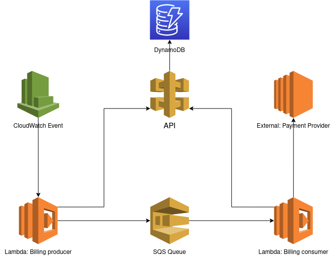

# Antaeus Solution

> Note: Another file kept for reference, [notes.md](./notes.md), contains raw notes I took during the challenge.

## Table of Contents

- [Process toward the solution](#process-toward-the-solution)
    - [Exploration phase](#exploration-phase)
    - [First iteration](#first-iteration)
    - [Second iteration](#second-iteration)
- [Proposed solution](#proposed-solution)
- [How-to](#how-to)
    - [Running the unit tests](#running-the-unit-tests)
    - [Running the service](#running-the-service)
- [Timing](#timing)
- [Learnings](#learnings)

## Process toward the solution

### Exploration phase

First, I spent some time exploring. I browsed through the different directories to get a feeling of how the project was
organized, and I discovered what Kotlin looked like. Then I needed to familiarize myself with the tooling. I installed
IntelliJ and Gradle and I undertook to find how to run the tests and how to run the project. Once I succeeded in testing
the service with Postman, I added as an exercise the capacity to retrieve invoices by status.

### First iteration

For the first iteration, the goal was quite simple: make it work. I kept the billing logic as simple as possible and
added a simple scheduler using coroutines. While it worked well enough in the testing environment, the solution felt
hacky and not suitable for production.

**Coroutine scheduler:**

```kotlin
// AntaeusApp.kt
fun main() {
    /* ... */

    runBlocking {
        launch {
            while (true) {
                if (DateTime.now().dayOfMonth == 1) {
                    logger.info { "Scheduled task, charge pending invoices" }
                    invoiceService.fetchAll(InvoiceStatus.PENDING).forEach {
                        billingService.processInvoice(it)
                    }
                } else {
                    logger.info { "No scheduled task today." }
                }
                delay(1.days)
            }
        }
    }
}
```

### Second iteration

After the first iteration, I felt more confident in my ability to write Kotlin and work with this new environment.
Therefore, I increased the scope of what I wanted to achieve. My objectives were:

- Try to write Kotlin as idiomatically as possible
- Testing: Unit tests and CI with Github Actions
- Randomize the Payment Provider mock's response to test all possibilities
- Replace the coroutine solution with something better

After some research, I based the improved solution on the [kjob](https://github.com/justwrote/kjob) library. The library
is also based on coroutines, but it brings some improvements to the table:

- an idiosyncratic way to express and schedule cron jobs
- a message queue system that handles retries and concurrent execution

```kotlin
// AntaeusApp.kt
object FirstOfMonth : KronJob("charge-invoices", "0 0 3 ? 1 * *")

object ProcessInvoiceJob : Job("process-invoice") {
    val id = integer("id")
}

fun main() {
    /* ... */

    val kjob = kjob(InMem) {
        nonBlockingMaxJobs = 3
        blockingMaxJobs = 3
        extension(KronModule)
    }.start()

    kjob.register(ProcessInvoiceJob) {
        executionType = JobExecutionType.NON_BLOCKING
        execute {
            billingService.processInvoice(props[it.id])
        }
    }

    kjob(Kron).kron(FirstOfMonth) {
        maxRetries = 3
        execute {
            kotlinLogger.info { "Scheduled task, charge pending invoices" }
            invoiceService.fetchAll(InvoiceStatus.PENDING).forEach {
                val id = it.id
                kjob.schedule(ProcessInvoiceJob) {
                    props[it.id] = id
                }
            }
        }
    }
}
```

## Proposed solution

The architecture still felt monolithic, so I thought I'd propose a change to a microservice architecture, as I would
have implemented if presented with the problem. I believe such an architecture has better separation of concerns, and is
easier to manage as the resources can scale independently in a cloud environment. I based the proposed solution on AWS
as it is the cloud provider I'm most familiar with.



Here is a brief description of its components:

- The API handles CRUD related operations, for our purposes it would include the Customer and Invoice services.
- The Scheduler is a simple CloudWatch Event. Every first of the month, it triggers the Billing Producer.
- The Billing Producer is a simple lambda. Its job is to query the API for pending invoices, possibly using pagination
  if there are too many entries. The invoices are then converted to job and posted to a SQS Message Queue.
- The Message Queue is a SQS. It's reliable, fully managed, cheap, and easy to use.
- The Billing Consumer is a lambda that consumes the Message Queue. It attempts to charge the invoice, and updates the
  Invoice status accordingly through the API. It uses an exponential backoff algorithm in case of network or unknown
  errors, which are safe to retry.

To approach it as closely as possible, I set up several docker containers with `docker-compose`:

- `pleo-antaeus` contains the pleo app along with the lambdas
- `rabbitmq` simulates SQS
- `scheduler` uses [lecovi/curl-cron](https://hub.docker.com/r/lecovi/curl-cron) and simulates a CloudWatch Event, it
  calls the API endpoint to trigger the billing process on a cron job

Notes: instead of RabbitMQ, I [tried to use Kafka](https://github.com/leonhfr/antaeus/pull/3) but couldn't make it work
due to a connection error. Looking back, it's probably the docker setup that was wrong.

## How-to

### Running the unit tests

```shell
$ gradle clean test
```

### Running the service

```shell
$ ./docker-clean.sh && ./docker-start.sh
```

The cron job runs every first of the month at 3 am. To trigger the billing process manually:

```shell
$ curl --location --request GET 'http://localhost:7000/rest/v1/billing'
```

## Timing

I think that overall, I will have spent around 15 hours on the project.

## Learnings

My experience is in Typescript, along with some Go and Rust, so those are the environments I'm familiar with. As I
didn't have any experience in Java, Kotlin, or the JVM, I had a bit of a learning curve at the beginning. Some remarks
on this are:

- IntelliJ was tough to get started with, I wasn't aware of how reliant I was on VS Code and my personal settings and
  shortcuts
- Kotlin is easier to work with than I expected, though as mentioned it took some adaptation; though I think my code
  isn't idiomatic
- the biggest obstacle was that due to my lack of experience with Kotlin and its tooling, I couldn't easily judge
  whether the solution was good or bad

I'm looking forward to some feedback on it!
